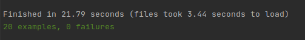

### Ruby Capstone Project
# Lazzy-Heist

Lazzy Heist is a Web Scraper built in Ruby. It scraps data for Movies and TV Shows listed under different categories from
the IMDb website.

Data Scraping is one of the way to extract desired data from a website. The information is collected and then exported into a format that is more useful for the users.


## Feature
You can select to extract data for either Movies or TV Shows:
1. Movies
2. TV Shows

Further sub-categories are available for both the categories:

1. Top-Rated Movies/TV Shows
2. Most Popular Movies/TV Shows

Save your desired data in a CSV file

## Presentation

[Watch Presentation Video](https://www.loom.com/share/24f2fbd839bc40aba43a473ff9753baa?sharedAppSource=personal_library)

## Build With
* Ruby
* Ruby Gems
    * HTTParty
    * Nokogiri
    * csv
    * RSpec
    
## Getting Started
* Clone the Repository to get a local copy
```
  git clone https://github.com/KumarAmitt/Lazzy-Heist.git
```
* Open Terminal or CLI 
* Navigate into the Repository
```bigquery
cd/path_to_folder
```
* Install Required Gems
```bigquery
bundle install
```
* Run the program 
```bigquery
ruby ./bin/main.rb
```
## Testing
To test the code make insure RSpec in installed

Run the following command to install RSpec
```bigquery
gem install rspec
```
Run the following command to install all dependencies
```bigquery
bundle install
```
Finally to test the code Run:
```bigquery
rspec
```
Note: Run all the commands under this section from the root directory

If all the test pass successfully you will get the following message



## Prerequisites
Ruby should by installed on your local machine.

Refer the official [installation guide](https://www.ruby-lang.org/en/documentation/installation/) to install Ruby.

## Save Your .csv file

* It creates a specific CSV file and writes into it if the file is not available

* If the file with the same name already available then it will overwrite it with the new data

* Please check the csv directory at the root level to see the generated .csv file

* The scraped data will be stored is this file and you cab save it.

## Author

👤 **Amit Kumar**

- GitHub: [@githubhandle](https://github.com/KumarAmitt)
- Twitter: [@twitterhandle](https://twitter.com/ArrshAmitt)
- LinkedIn: [LinkedIn](www.linkedin.com/in/kumar-amitt)

## 🤝 Contributing

Contributions, issues, and feature requests are welcome!

Feel free to check the [issues page](https://github.com/KumarAmitt/Lazzy-Heist/issues).

## Show your support

Give a ⭐️ if you like this project!

## Acknowledgments

- Hat tip to anyone whose code was used
- Thanks to IMDb for allowing to scrap data


## 📝 License
&copy; 2020 Amit Kumar

Permission is hereby granted, free of charge, to any person obtaining a copy
of this software and associated documentation files (the "Software"), to deal
in the Software without restriction, including without limitation the rights
to use, copy, modify, merge, publish, distribute, sublicense, and/or sell
copies of the Software, and to permit persons to whom the Software is
furnished to do so, subject to the following conditions:

The above copyright notice and this permission notice shall be included in all
copies or substantial portions of the Software.

THE SOFTWARE IS PROVIDED "AS IS", WITHOUT WARRANTY OF ANY KIND, EXPRESS OR
IMPLIED, INCLUDING BUT NOT LIMITED TO THE WARRANTIES OF MERCHANTABILITY,
FITNESS FOR A PARTICULAR PURPOSE AND NONINFRINGEMENT. IN NO EVENT SHALL THE
AUTHORS OR COPYRIGHT HOLDERS BE LIABLE FOR ANY CLAIM, DAMAGES OR OTHER
LIABILITY, WHETHER IN AN ACTION OF CONTRACT, TORT OR OTHERWISE, ARISING FROM,
OUT OF OR IN CONNECTION WITH THE 
